# S&P Index VS S&P Futures - Is there an arbitrage opportunity?

Our goal is to evaluate the relative price changes of S&P 500 futures (front ES and MES contract) vs SPY ETF over a period of 4 years to determine if there is any opportunity for arbitrage. Additionally, we will analyze WTI with the same financial analysis tools.  
 
How strong of a correlation will we find? Do different time periods matter?  

# Introduction:

Intrigued by the launch of the micro e-mini contracts for major indices by the CME on May 6, 2019, we chose to delve further into the market's adoption of the new indices.  Noting that the new contracts allow market participants to gain exposure to price fluctuations in the S&P 500, Russell, Dow Jones 30, and Nasdaq indices at minimal costs than the existing e-minis, we sought to demonstrate that the price movements across the three S&P500 futures indices were highly correlated such that an arbitrage opportunity did not exist during the burst of uncertainty.  At the core of our analysis, we focused on the possibility of arbitrage over four years that registered a few seismic events, including but not limited to a global pandemic (COVID), elections resulting from uncertainty in the US, Russia's invasion of Ukraine, and a global inflationary environment caused by global supply-chain disruptions and a reduction oil production capacity by OPEC during the early days in the Pandemic. 

We have excluded analysis on the rollover effect of the futures contracts to the overall performance of the comparison between futures and the SPY ETF. 

# Definitions and Description:

## Futures Contract: 
Derivative financial contracts that obligate parties to buy or sell an asset at a predetermined future date and price. 

## Exchange Traded Fund (ETF):
ETFs or "exchange-traded funds" are exactly as the name implies: funds that trade on exchanges, generally tracking a specific index. When you invest in an ETF, you get a bundle of assets you can buy and sell during market hours. 

## E-Mini (ES) S&P 500 Futures Contract:  
The E-mini S&P 500 futures contract tracks the S&P 500 Index. It trades on the Chicago Mercantile Exchange (CME) under the ticker symbol ES. The contract tracks the stock prices of the largest U.S. companies listed on the S&P 500 Index. Investors can use contracts as a way to hedge or speculate on the future of the S&P 500 Index. The E-mini S&P 500 futures contract is $50 x the S&P 500 Index and has a minimum tick of .25 index points. This translates to $50 per single point change and $12.50 per tick. 
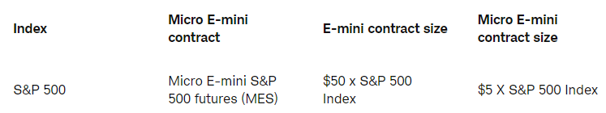

## Micro E-mini (MES) S&P 500 Futures Contract:  
Micro E-mini S&P 500 futures (MES) offer smaller-sized versions of the Chicago Mercantile Exchange's (CME) liquid benchmark E-mini contracts.
They are designed to manage exposure to the 500 U.S. large-cap stocks tracked by the S&P 500 Index, widely regarded as the best single gauge of the U.S. stock market. The Micro E-mini S&P 500 futures contract is $5 x the S&P 500 Index and has a minimum tick of 0.25 index points. This translates to $5 per single point change and $1.25 per tick. 
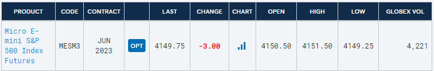

## SPY ETF:  
The SPDR S&P 500 ETF Trust (SPY) is one of the most popular Exchange Traded Funds. It aims to track the Standard & Poor’s (S&P) 500 Index, which comprises 500 large-cap U.S. stocks. These stocks are selected by a committee based on market size, liquidity, and industry. The S&P 500 serves as one of the main benchmarks of the U.S. equity market and indicates the financial health and stability of the economy. Also known as the SPY ETF, the fund was established in January 1993.  
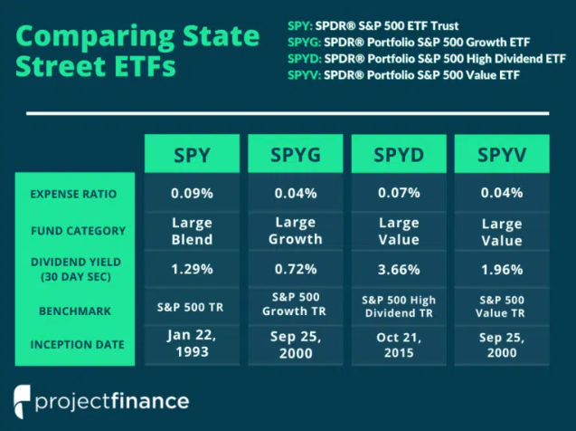

## WTI Futures Contract:  
WTI stands for West Texas Intermediate (occasionally called Texas Light Sweet), an oil benchmark that is central to commodities trading. It is one of the three major oil benchmarks used in trading, the others being Brent crude and Dubai/Oman. The volatility of crude oil prices after the US oil price decontrol led to the development of the NYMEX WTI Light Sweet Crude Oil futures contract in 1983. The NYMEX Crude Oil contract trades under the symbol CL on the New York Mercantile Exchange, now part of Chicago Mercantile Exchange. The contract is for 1,000 US barrels, or 42,000 US gallons, of WTI crude oil, the minimum tick size of the contract is $0.01 per barrel ($10 for contract), and the contract price is quoted in US dollars. Monthly contracts are available for the current year, the following 10 calendar years, and 2 additional months.  
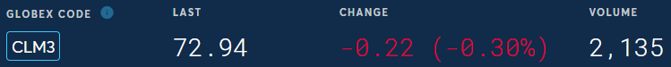

Financial Metrics Analyzed: Monte Carlo, relative price/correlation, annual return, sharpe ratio, other financial metrics  

Date Range of all data sets: May 2019 - May 2023  

# Corelation between SPY and Futures:

## How well does the SPY EFT vs ES vs MES coorelate?
It appears they all coorelate very well. So well in fact, that it is nearly impossible to differenciate the lines in the chart below. 

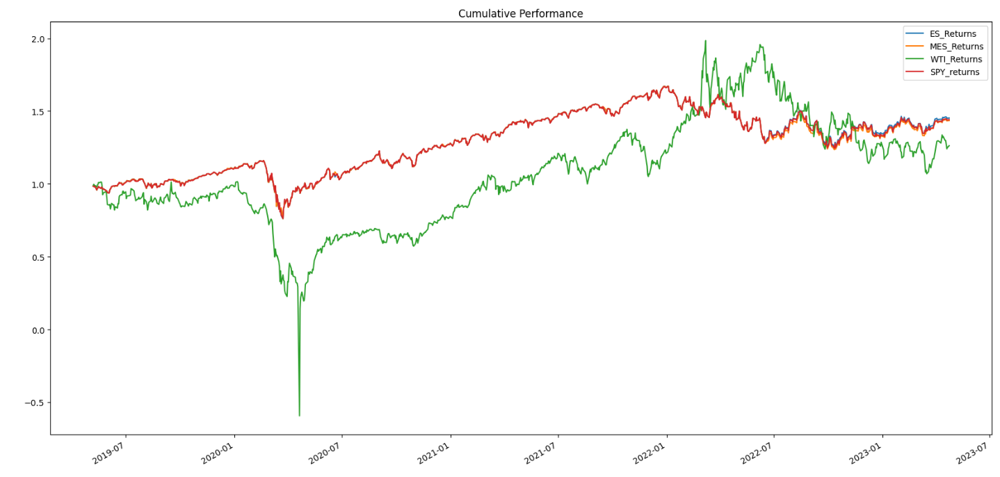

The cumulative performance charts were extremely interesting as the volatility in equities paled in comparison to the WTI volatility. WTI crude oil prices even went negative in 2020 at the height of the supply glut and rebounded from there.  
## 4 Year Correlation Matrix 

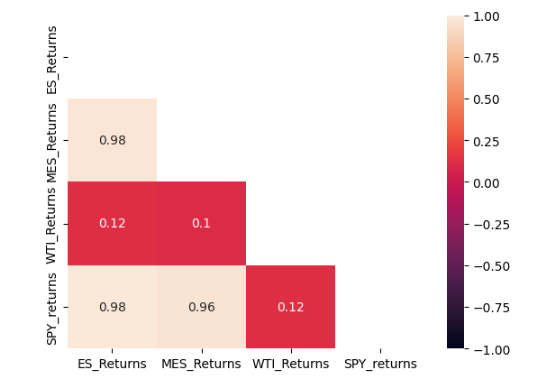

Over the course of the entire time period, WTI crude oil exhibited essentially no correlation with the SPY ETF nor the S&P futures contracts. 
## Inflation Period Correlation Matrix 
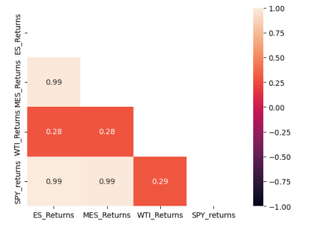

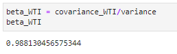

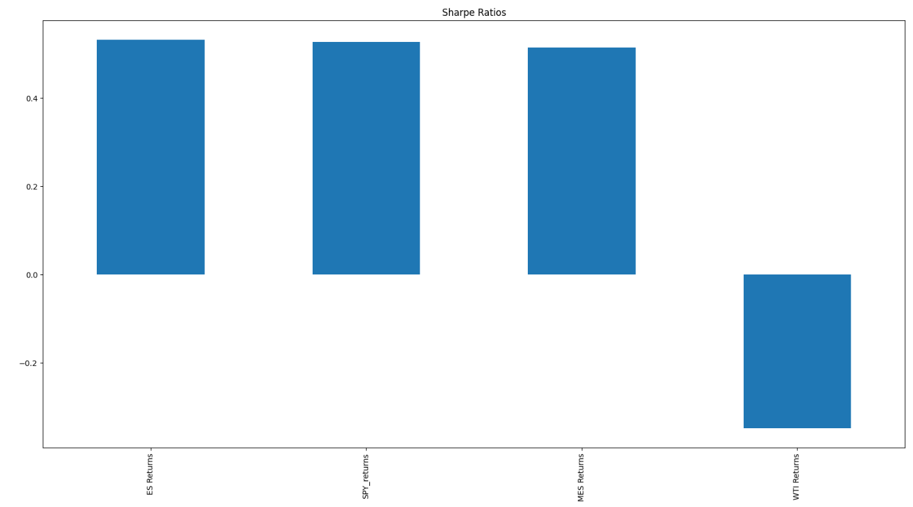

However, during the “inflationary period,” defined as November 2022 through end of April 2023, we noticed the correlation between WTI crude oil and the S&P products increased substantially which is consistent with our understanding of the recent similar trending in stocks and oil. However, this is still a weak correlation. Interestingly, the beta of WTI crude oil relative to SPY was almost 1 for the full time period. This would indicate that WTI and S&P have similar systematic risk but a weak linear correlation for the time period. Given both assets are subject to similar systematic risk and upon reviewing the Sharpe Ratios, we would much rather invest in S&P products on a risk-adjusted basis. 

Given we are more interested in S&P products, we decided to check out trends in their notional volumes (dollars traded). Unsurprisingly, the e-mini S&P futures contract (ES) volumes outpaced that of the ETF (SPY) and the micro e-mini contract (MES). This made sense to us given ES is primarily used by larger institutional traders to gain/reduce exposure. 

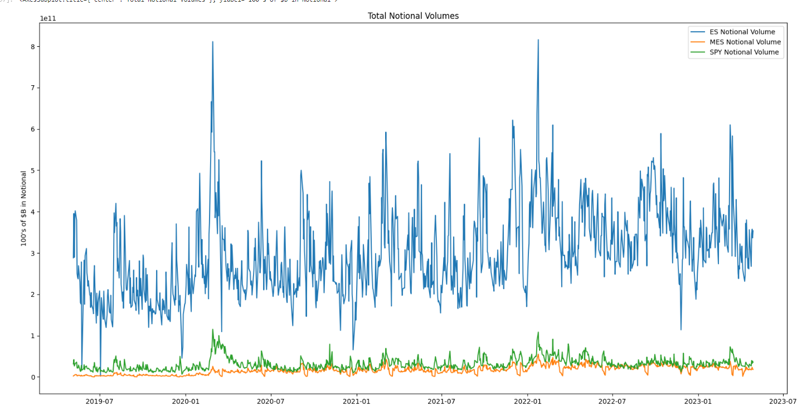

However, MES has grown the most in terms of cumulative percentage change in notional volume. 

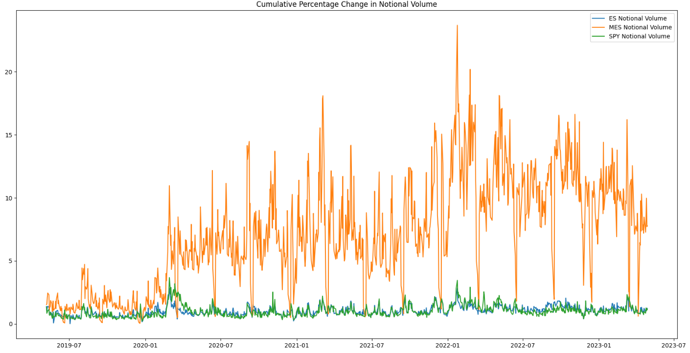

We perform MC simulation for the 4 stocks using [MCForecastTools.py](./MCForecastTools.py). The following plot shows the expected 95% CL returns for a $10k initial investment after 5 years. 

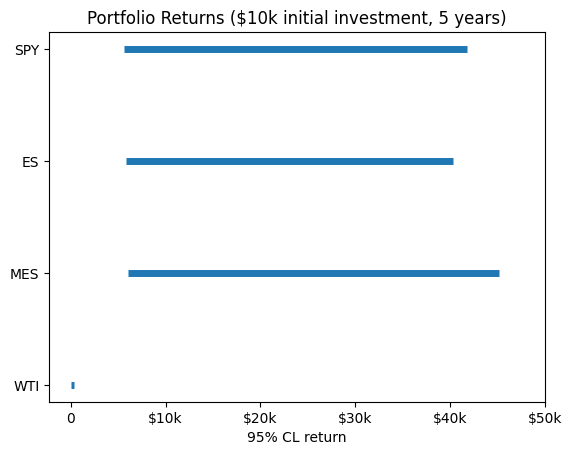.

The returns are essentially the same for SPY, ES and MES as expected. The return is close to 0 for WTI. 

# ***Tools used for Data Analysis:***

* Alpaca API data for SPY price history.
* Correlation Matrices 
* HVPlot: Visualize relative profiles 
* Monte Carlo Simulation 
* Pandas: data cleaning/calculating returns 

# ***Data Sources***

* Alpacaenv to download SPY historical data
* Yahoo Finance to download E-mini and Micro E-mini historical data
* Energy Information Adminstration to download WTI (West Texas Intermediate) Crude Oil prices

# ***Presentation***

[Presentation](https://docs.google.com/presentation/d/1bz8jx4omebZrJj4sUPPEsDsIIzEs5WVP_iDobCj-xEo/edit?usp=sharing)

# ***Team Members***
Susan Bengo   
Michael Cody  
TJ Wentling  
Tingjun Yang  
